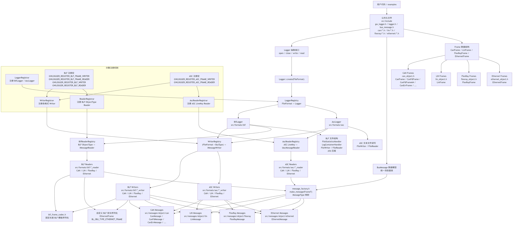

# BLF ASC I/O Library


## 当前支持

| 总线 | BLF 写入 | BLF 读取 | ASC 写入 | ASC 读取 | 当前基础帧 |
| --- | --- | --- | --- | --- | --- |
| CAN / CAN FD | 支持 | 支持 | 支持 | 支持 | `CanMessage` / `CanFdMessage` / `CanErrMessage` 等 |
| LIN | 支持 | 支持 | 支持 | 支持 | `LinMessage` / `LinFrame` |
| FlexRay | 支持 | 支持 | 支持 | 支持 | `FlexRayMessage` / `FlexRayFrame` |
| Ethernet | 支持 | 支持 | 支持 | 支持 | `EthernetMessage` / `EthernetFrame` |

ASC 基础行示例：

```text
0.001840 1 187 Rx d 8 8 63 C6 61 C4 5F C2 5D C0 0 0 0
0.001845 CANFD 1 Rx 126 0 0 0 8 8 00 00 00 00 00 00 00 00 8 0 1000 0 0 0 0 0
0.001000 LIN 1 Rx 12 8 01 02 03 04 05 06 07 08 0
0.001000 FLEXRAY 1 Rx 100 2 8 0 0 01 02 03 04 05 06 07 08
0.001000 ETHERNET 1 Rx 00:11:22:33:44:55 AA:BB:CC:DD:EE:FF 800 0 0 4 DE AD BE EF
```

GWLogger 是一个 C++17 总线日志读写库。当前支持 BLF 和 ASC 文件格式，面向高速写入本地文件和从文件中还原总线帧数据两类场景。

## 设计目标

```text
- 格式可扩展：当前支持 BLF、ASC，后续可以扩展 MDF 或私有协议格式。
- 总线可扩展：当前以 CAN/CAN FD 为主，支持标准 LIN、FlexRay、Ethernet 格式，可自行定义其他总线结构扩展。
- 帧类型可扩展：每种总线可以按自身协议扩展新的帧类型，例如 CAN 的 `CanMessage`、`CanMessage2`、`CanErrMessage`、`CanFdMessage64` 等。
- 接口简洁：用户侧优先包含一个聚合头 `gw_logger.h`。
- 注册分散：新增格式、总线或帧类型时，可以在新增 cpp 中完成自注册，不需要维护一个集中注册表文件。
- 写入高效：BLF 写入先进入内存缓冲，再批量写入 LogContainer；支持 zlib 压缩。
```

## 性能测试
```text
 benchmark.cpp 极限测试 500000000 帧数据时，内存消耗处于 75 ~ 105 MB 之间
 当缓存帧超过阈值，对调用writer速率进行控制，避免内存暴涨。
 benchmark 测试结果如下:
 2026-07-01T23:10:33+08:00
 Running G:\C++\BLF\cmake-build-release\bin\benchmark_test.exe
 Run on (16 X 3110 MHz CPU s)
 CPU Caches:
 L1 Data 48 KiB (x8)
 L1 Instruction 32 KiB (x8)
 L2 Unified 1280 KiB (x8)
 L3 Unified 18432 KiB (x1)
 progress : 4598710/500000000 0.92% elapsed=2.015s remain=217.089s speed=2282023 frame/s
 progress : 8798804/500000000 1.76% elapsed=4.029s remain=224.900s speed=2184086 frame/s
 progress : 11798904/500000000 2.36% elapsed=6.043s remain=250.050s speed=1952414 frame/s
 progress : 15999001/500000000 3.20% elapsed=8.058s remain=243.785s speed=1985362 frame/s
 progress : 19899097/500000000 3.98% elapsed=10.065s remain=242.841s speed=1977017 frame/s
 progress : 24099187/500000000 4.82% elapsed=12.072s remain=238.403s speed=1996205 frame/s
 progress : 28299279/500000000 5.66% elapsed=14.084s remain=234.760s speed=2009293 frame/s
 ......
 progress : 485809743/500000000 97.16% elapsed=237.020s remain=6.923s speed=2049661 frame/s
 progress : 490009837/500000000 98.00% elapsed=239.033s remain=4.873s speed=2049968 frame/s
 progress : 494209930/500000000 98.84% elapsed=241.047s remain=2.824s speed=2050264 frame/s
 progress : 498710024/500000000 99.74% elapsed=243.061s remain=0.629s speed=2051787 frame/s
 progress : 500000000/500000000 100.00% elapsed=245.070s remain=0.000s speed=2040237 frame/s
 end time : 1782918878769750300 object_count = 500000000
---------------------------------------------------------------------------------------
Benchmark                             Time             CPU   Iterations UserCounters...
---------------------------------------------------------------------------------------
BM_BLFWrite_CorrectLifecycle 2.4509e+11 ns   6.9031e+10 ns            1 bytes_per_second=447.61Mi/s
```

## 数据准确性验证
```text
 保存的 blf 文件均通过 canoe 进行解析验证格式准确性 
 ```


## 快速使用

```cpp
#include "gw_logger.h"

#include <chrono>

static uint64_t now_us()
{
    auto now = std::chrono::system_clock::now();
    return std::chrono::time_point_cast<std::chrono::microseconds>(
        now).time_since_epoch().count();
}

int main()
{
    auto logger = GWLogger::Logger::create(GWLogger::FileFormat::BLF);
    if (!logger || !logger->open("test.blf", GWLogger::OpenMode::Write)) {
        return -1;
    }

    logger->set_compres_level(6);
    logger->set_timestamp_unit(GWLogger::TimeStampUnit::BLF_TIME_ONE_NANS);

    GWLogger::CanFrame frame{};
    frame.channel = 1;
    frame.flags = GWLogger::TX;
    frame.dlc = 8;
    frame.id = 0x123;

    auto msg = GWLogger::make_message(frame);
    msg->set_timestamp(now_us() * 1000ULL);
    logger->write(std::move(msg));

    logger->close();
    return 0;
}
```

## 流程与架构


## 注册机制

库保留分散式静态注册。新增能力时，在对应 cpp 中声明一个静态 registrar 即可。

格式注册示例：

```cpp
static LoggerRegistrar<BlfLogger> registrar(FileFormat::BLF);
```

writer 注册示例：

```cpp
GWLOGGER_REGISTER_BLF_FRAME_WRITER(
    CanMessageBlfWriter,
    CanMessage,
    CanFrame,
    BL_OBJ_TYPE_CAN_MESSAGE,
    BusType::CAN)
```

BLF reader 注册示例：

```cpp
GWLOGGER_REGISTER_BLF_FRAME_READER(
    CanMessageBlfReader,
    CanFrame,
    BL_OBJ_TYPE_CAN_MESSAGE)
```

ASC reader 注册示例：

```cpp
static AscReaderRegistrar<CanMessageAscReader> reg_can(
    AscLineKey::CanClassic);
```

## 扩展一个 BLF 帧类型

对于“BLF 对象头 + 时间戳头 + POD 帧体”的帧类型，可以直接复用 `BlfFrameWriter` 和 `BlfFrameReader` 模板。

1. 定义帧结构，例如：

```cpp
struct MyCanFrame {
    uint16_t channel;
    uint32_t id;
    uint8_t data[8];
};
```

2. 定义消息类，并特化 `MessageType<FrameT>`：

```cpp
class MyCanMessage : public BusMessage {
public:
    explicit MyCanMessage(const MyCanFrame& frame);
    BusType get_bus_type() const override;
    uint64_t get_timestamp() const override;
    void set_timestamp(uint64_t timestamp) override;
    const MyCanFrame& get_frame() const;
};

template <>
struct MessageType<MyCanFrame> {
    using type = MyCanMessage;
};
```

3. 定义 BLF writer：

```cpp
#include "blf_frame_registration.h"
#include "can/my_can_message.h"

namespace GWLogger::Blf
{

GWLOGGER_REGISTER_BLF_FRAME_WRITER(
    MyCanMessageBlfWriter,
    MyCanMessage,
    MyCanFrame,
    BL_OBJ_TYPE_MY_CAN_MESSAGE,
    BusType::CAN)

}
```

4. 定义 BLF reader：

```cpp
#include "blf_frame_registration.h"
#include "can/my_can_message.h"

namespace GWLogger::Blf
{

GWLOGGER_REGISTER_BLF_FRAME_READER(
    MyCanMessageBlfReader,
    MyCanFrame,
    BL_OBJ_TYPE_MY_CAN_MESSAGE)

}
```

如果某个 BLF 对象不是简单 POD 帧体，仍然可以手写 `IMessageWriter` 或 `IMessageReader`，注册机制不变。

## 目录约定

当前目录仍兼容已有结构：

```text
src/include/              公共 API
src/include/can/          CAN 消息类型
src/include/                         公共 API，用户侧 include 入口
src/include/can/                     CAN 公共消息头
src/core/api/                        公共 API 实现与内部抽象接口
src/core/io/                         文件读写封装
src/core/registry/                   注册表与 registrar
src/core/internal_define.h           内部常量
src/formats/blf/                     BLF 格式实现
src/formats/blf/can_writer/          CAN BLF writer 自注册 cpp
src/formats/blf/can_reader/          CAN BLF reader 自注册 cpp
src/formats/asc/                     ASC 格式实现
src/formats/asc/can_writer/          CAN ASC writer
src/formats/asc/can_reader/          CAN ASC reader
src/messages/object/can/             CAN 消息对象实现
src/examples/                        示例程序
```

新代码建议使用小写蛇形文件名、PascalCase 类型名、`GWLogger` 命名空间。用户侧可以使用兼容别名：

```cpp
namespace gwlogger = GWLogger;
```

## 构建

项目使用 CMake 和 Conan。

```bash
cmake -S . -B build -DCMAKE_BUILD_TYPE=Release
cmake --build build -j
```

Windows 下请确保 Visual Studio C++ 工具链和 Windows SDK 安装完整。

## 依赖

- C++17
- CMake 3.20+
- zlib
- Conan

## 编译说明
### Linux
 ```text
 项目使用 Conan 包管理工具，编译器为 Nijia 编译前要先配置 conan 环境，若是觉得 conan 使用麻烦可以使用 vcpkg 功能一致
 本项目就不修改了
 1. 安装 conan  通过 pip 安装
    sudo apt install python3-pip
    pip install conan 
 2.设置环境变量  可以直接在 ～/.bashrc 中添加
    export PATH=$PATH:/home/t/.local/bin
    
 3.编译
 设置依赖环境 （这是由于有的IDE无法识别到系统环境变量所以需要在 IDE 中再加一次）
 PATH=～/.local/bin:$PATH
 或者 
 -DCONAN_COMMAND=path/to/conan 
 cmake 链接宏
 -DCMAKE_PROJECT_TOP_LEVEL_INCLUDES=cmake/conan/conan_provider.cmake
 Conan 下载包时过程比较缓慢，可能因为网络问题中断，多次重试即可，第一次下载完成之后，后续不会再次下载
```

### windows 
```text
 1. 确保已安装 Conan 并配置好环境变量，pip install conan。
 2. 使用 CLion 打开项目，CLion 会自动识别 CMakeLists.txt。
 3. 在 CMake 选项中添加 Conan 工具链配置：
   -DCMAKE_PROJECT_TOP_LEVEL_INCLUDES=cmake/conan/conan_provider.cmake
   新版 Clion 需要手动指定 Conan 路径（如果未在 PATH 中）：
    -DCONAN_COMMAND=path/to/conan   
    如：C:\Users\T\AppData\Roaming\Python\Python312\Scripts\conan.exe
```

## 状态说明

当前 BLF CAN reader/writer 已复用 `BlfFrameWriter` 和 `BlfFrameReader` 模板，保留原有类名和分散式注册方式。ASC 文本格式因为解析规则和输出格式差异更大，仍保留专用实现。
